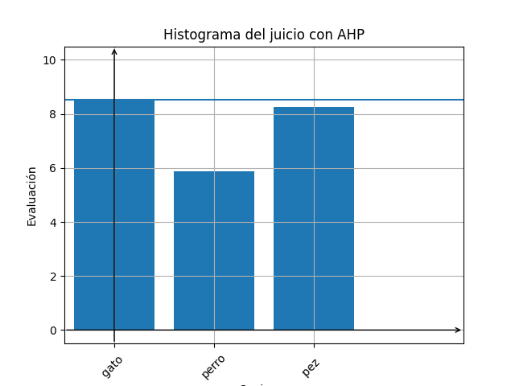

# 1. Synopsis
AHP allow the analytic hierarchy process by a python script.

## 1.1 Code meaning
A mathematical, and coherent, translation of human choices is provided by using AHP methodology.

## 1.2 Motivation
Supply to everyone a clear description of the process (with also the motivation), an a visual image of the result. 

# 2. Installation
Check the presence of Pipfile into the main directory. And run: 

	$ pipenv shell 

then 
	
	$ pipenv install 

# 3. Use (in case of provided settings files)

Then, only execute the _ahp_.py file in the same directory you download the main file:

	python ahp.py

The folders called *choices_all* and _choices_ should stay in the same directory too. 

Other language translation is provided: Spanish and Italian. 
To run the script in an other language use: 

	python ahp.py <languane_abreviation>

like _it_ or _es_.

## 3.1 Expected result
Both a graph output and a text output are expected. 

The text output lists the values used during the process. 
Here using the Spanish and a pet comparation. 

	Haz juzgado:
	»  Tu juicio gato  	 basado en el criterio autonomia    	 with  10
	»  Tu juicio perro 	 basado en el criterio autonomia    	 with  5

# 4. Use (from zero data)
To run the AHP process, each case must be saved as a text file in the "choices" directory.
You can use an already prepared file as pattern.

To use the prepared pattern, you need to supply the list of choices and of the criteria involved in the process, and to call the file the_name_you_want_CC.txt.

	So, for instance, the file mobile_CC.txt, should contain: 

	[:opz:]
	opz_1  # comment
	opz_2  # comment
	opz_3  # comment
	[/:opz:]

	[:crit:]
	crit_1  # comment
	crit_2  # comment
	crit_3  # comment
	crit_4  # comment
	[/:crit:] 

To a correct visualization, please, avoid unicode character in variables (they don't matter in comment).

About the numerical evaluations. 
	You can translate as "A is really really more important than B" as:
						B		
	A 			-->     8	-->  because of ...

	The scale may be:
	2	"A is a little bit 		more 		important than B"
	3	"A is 			 		more 		important than B"
	6	"A is really	 		more 		important than B"
	9	"A is extremely	 		more 		important than B"
	1/2	"A is a little bit		less 		important than B"
	1/3	"A is 			 		less 		important than B"
	1/6	"A is really	 		less 		important than B"
	1/9	"A is extremely	 		less 		important than B"

Example:

	[:g_c:]
						B_criteria        
	A_criteria		--> 		3		--> 	     
						C_criteria         
	A_criteria 		--> 		5		--> 	 

	In this situation, with respect to the A_criteria, C_criteria is less important than B_criteria.

# 5. Tests
The script is provided with a test file (called “ahp_test.py”) for testing. 

# 6. License
Apache